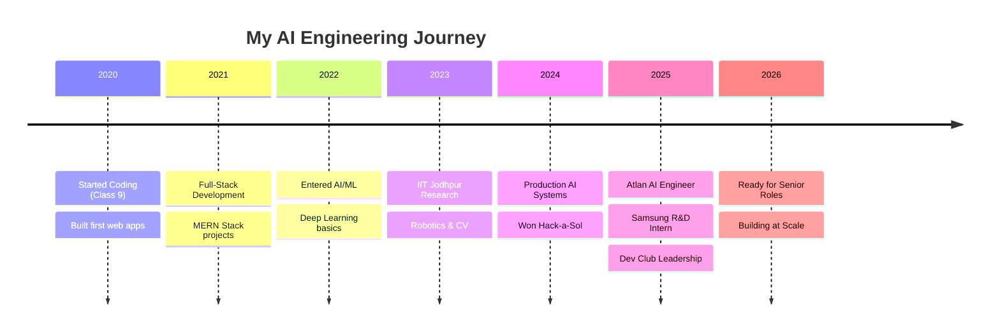

<div align="center">

<!-- Animated Typing SVG Header -->
<a href="https://git.io/typing-svg">
  
</a>

<!-- Animated Wave -->


</div>

---

<div align="center">

### 🎯 **Senior AI Engineer Ready for Production**

**Currently:** AI Engineer @ Atlan | R&D @ Samsung | Dev Club Head @ IIIT-NR

[](https://linkedin.com/in/-manas-choudhary-)
[](https://instagram.com/the_never_ending_guy)
[](mailto:your.email@gmail.com)


</div>

---

<div align="center">

## 💥 **What I Actually Do**

</div>

```javascript
const manas = {
    role: "Senior AI Engineer (Workforce Ready)",
    current: ["Atlan AI Systems", "Samsung R&D", "IIIT-NR Dev Club Head"],
    expertise: {
        ai_ml: ["Fine-tuned Llama 3.1 8B", "Multi-Agent (20+ agents, <500ms)", 
                "RAG (92% precision)", "LangChain", "CrewAI", "Neo4j"],
        engineering: ["Python", "C++", "TypeScript", "React/Next.js", 
                      "FastAPI", "Docker", "Microservices"],
        production: ["Security", "Monitoring", "Scalability", "Deployment"]
    },
    achievements: {
        hackathons: "🥇 1st Place x2 | 🥈 2nd Place",
        research: "IIT Jodhpur Robotics",
        leadership: "50+ students mentored"
    },
    motto: "Building AI that ships to production, not just demos 🚀"
};
```

---

<div align="center">

## 🏆 **Achievement Unlocked**


</div>

---

<table align="center">
<tr>
<td width="50%" align="center">

### 🎯 **Victory Board**

🥇 **1st Place** - IAM 2025  
🥇 **1st Place** - Hack-a-Sol AI/ML  
🥈 **2nd Place** - Hack-o-Harbor  
🎓 **Research** - IIT Jodhpur  
👨‍💻 **Leadership** - Dev Club Head  

</td>
<td width="50%" align="center">

### ⚡ **Power Stats**

**Multi-Agent Systems:** 20+ agents in parallel  
**Latency:** <500ms orchestration  
**RAG Precision:** 92% accuracy  
**Fine-tuning:** Llama 3.1 8B (LoRA)  
**Students Mentored:** 50+  

</td>
</tr>
</table>

---

<div align="center">

## 🛠️ **Arsenal**

### AI/ML Powerhouse

<p>
  
  
  
  
  
  
</p>

### Engineering Stack

<p>
  
  
  
  
  
  
</p>

### Databases & Tools

<p>
  
  
  
  
  
  
</p>

</div>

---

<div align="center">

## 🚀 **Featured Work**

</div>

<table align="center">
<tr>
<td width="50%">

### 🌟 Project Lumen
**🥇 1st Place Hack-a-Sol**

- Fine-tuned **Llama 3.1 8B** with LoRA
- **4-stage Hybrid RAG** pipeline
- **20+ AI agents** in parallel
- **Neo4j** knowledge graphs
- **92% precision** retrieval
- **<500ms** latency

</td>
<td width="50%">

### 🎓 PlacePro
**Production T&P System**

- **Microservices** architecture
- AI-powered **JAF processing**
- Real-time **analytics**
- Used by **500+ students**
- **80% workflow** automation
- Live deployment

</td>
</tr>
<tr>
<td width="50%">

### 🧠 Strategic Code Companion
**AI Code Analysis**

- **Multi-agent** architecture
- Semantic code analysis
- Architecture review
- Real-time refactoring
- Documentation generation
- Production-ready

</td>
<td width="50%">

### 🤖 Smart Traffic System
**Hackathon Project**

- **Reinforcement learning**
- Multi-agent orchestration
- Real-time processing
- Traffic optimization
- Comprehensive architecture
- Technical documentation

</td>
</tr>
</table>

---

<div align="center">

## 📊 **Battle Stats**


</div>

---

<div align="center">

## 🐍 **Contribution Snake Eating My Commits**


<!-- To enable this, you need to:
1. Create a .github/workflows/snake.yml file in your profile repo
2. Add the following code:

name: Generate Snake

on:
  schedule:
    - cron: "0 */12 * * *"
  workflow_dispatch:

jobs:
  build:
    runs-on: ubuntu-latest
    steps:
      - uses: actions/checkout@v2
      - uses: Platane/snk@v3
        with:
          github_user_name: manaspros
          outputs: |
            dist/github-contribution-grid-snake.svg
            dist/github-contribution-grid-snake-dark.svg?palette=github-dark
      - uses: crazy-max/ghaction-github-pages@v2.1.3
        with:
          target_branch: output
          build_dir: dist
        env:
          GITHUB_TOKEN: ${{ secrets.GITHUB_TOKEN }}
-->

</div>

---

<div align="center">

## 💼 **Why Companies Should Hire Me**

</div>

<table align="center">
<tr>
<td width="33%" align="center">

### 🎯 Production-First

Every system I build has:
- Security layers
- Monitoring
- Error handling
- Scalability
- Deployment pipelines

**Not a typical fresher.**

</td>
<td width="33%" align="center">

### 🚀 Research → Production

I bridge the gap:
- Read research papers
- Implement algorithms
- Optimize performance
- Ship with best practices

**Engineering matters.**

</td>
<td width="34%" align="center">

### 👥 Proven Leadership

- **Dev Club Head**
- **50+ students** mentored
- Multiple hackathons won
- Team collaborator
- Community builder

**Impact multiplier.**

</td>
</tr>
</table>

---

<div align="center">

## 📈 **GitHub Insights**

<details>
<summary>🔥 <b>Contribution Heatmap</b></summary>
<br>

</details>

<details>
<summary>🏅 <b>Achievement Showcase</b></summary>
<br>

</details>

<details>
<summary>⚡ <b>Coding Activity</b></summary>
<br>

</details>

</div>

---

<div align="center">

## 🎓 **Journey Timeline**



</div>

---

<div align="center">

## 💭 **Random Dev Quote**


</div>

---

<div align="center">

## 🔥 **Contribution Streak**


</div>

---

<div align="center">

## 📫 **Let's Build Something Incredible**

**Open to:** Senior AI Engineer / AI Architect positions  
**Specialization:** Production AI systems at scale  
**Location:** India (Open to relocation)  
**Status:** Available immediately

<p>
  <a href="https://linkedin.com/in/-manas-choudhary-">
    
  </a>
  <a href="mailto:your.email@gmail.com">
    
  </a>
  <a href="https://instagram.com/the_never_ending_guy">
    
  </a>
</p>

</div>

---

<div align="center">

### 💡 ***"Building AI systems that work in production, not just in demos"***


---

⭐️ **From [Manas Choudhary](https://github.com/manaspros)** ⭐️

**Last Updated:** February 2026 🚀

</div>
